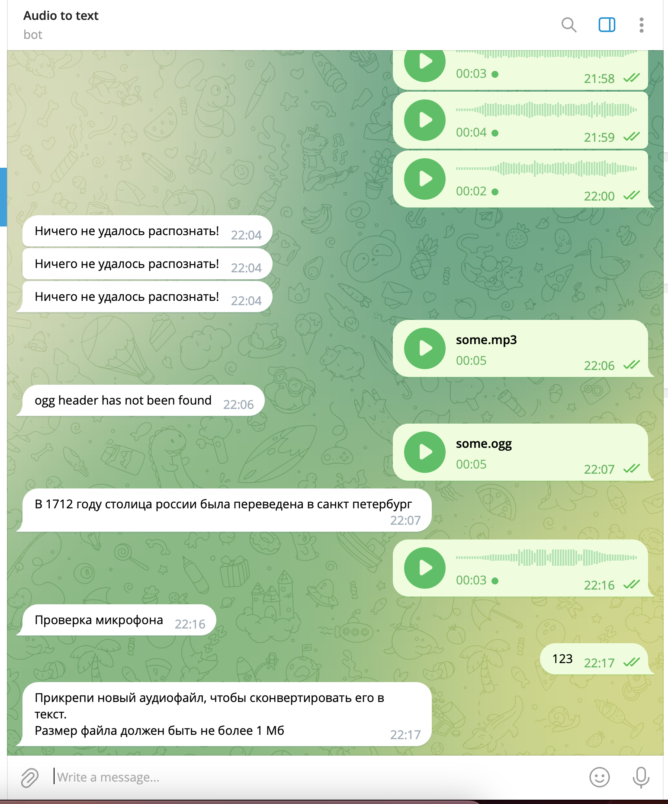

# telegram_audio_to_text
Тестовое задание конвертировать Audio в текст в Telegram боте\
Ограничения принимаемого файл:\
-ogg формат\
-запись голоса telegram\
-меньше 30 секунд

---

**.example.env** пример переменных, которые используются в боте\
ENV переменные прокидываются через файл **.env**

# Установка гемов
```
bundle install
```

# Запуск Telegram бота
```
ruby main.rb
```

---


